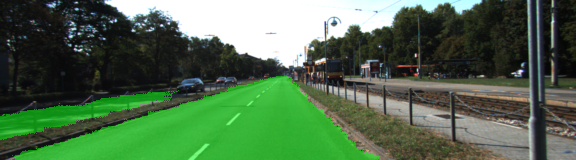
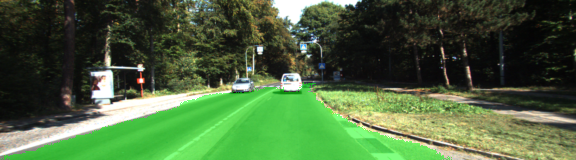
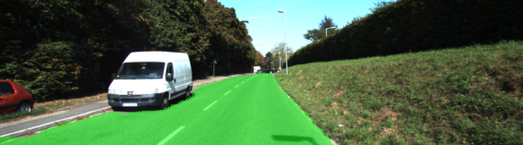
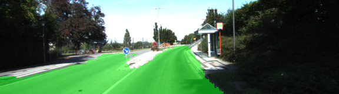
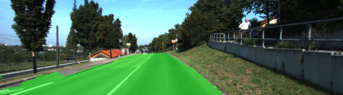
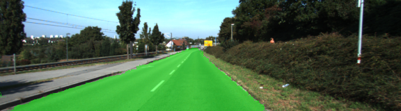

# Semantic Segmentation

## Introduction

In this project, I have labeled the pixels of a road in images using a Fully Convolutional Network (FCN).
The network is based on the VGG-16 model and extended to perform semantic segmentation on the KITTI dataset.

## Approach
I used a pretrained VGG-16 model, where I converted layer 3, 4, and 7 to fully convolutional layers.
This allows the input to be of any size equal to or larger than the original images.

I then upsampled layer 7 by 2 using a transposed convolution and combined it with layer 4 using a simple add-operation. This is called a skip-connection.
The same was done for layer 4, which was upsampled by 2 and combined with layer 3.
Finally, layer 3 was upsampled by 8 to match the input size.
The new upsampled layers that were introduced each include a kernel initializer and a kernel regularizer.

I used cross-entropy as loss function and an Adam optimizer for optimization.

### Hyperparameters
The following hyperparameters were used. These were all found empirically.

  - epoch: 20
  - batch_size: 8
  - learning_rate: 0.0001
  - keep_prob: 0.75

## Results
The accumulated loss for a complete epoch started at ~30 and converged to ~1.6 after 20 epochs.

Below, a few sample images from the test set show some qualitative results.

### Samples

Below are a few sample images from the output of the fully convolutional network, with the segmentation class overlaid upon the original image in green.










More qualitative results are available in the ./runs folder of the repository.

---

### Setup
##### Frameworks and Packages
Make sure you have the following is installed:
 - [Python 3](https://www.python.org/)
 - [TensorFlow](https://www.tensorflow.org/)
 - [NumPy](http://www.numpy.org/)
 - [SciPy](https://www.scipy.org/)
##### Dataset
Download the [Kitti Road dataset](http://www.cvlibs.net/datasets/kitti/eval_road.php) from [here](http://www.cvlibs.net/download.php?file=data_road.zip).  Extract the dataset in the `data` folder.  This will create the folder `data_road` with all the training a test images.

### Start
##### Implement
Implement the code in the `main.py` module indicated by the "TODO" comments.
The comments indicated with "OPTIONAL" tag are not required to complete.
##### Run
Run the following command to run the project:
```
python main.py
```
**Note** If running this in Jupyter Notebook system messages, such as those regarding test status, may appear in the terminal rather than the notebook.

### Submission
1. Ensure you've passed all the unit tests.
2. Ensure you pass all points on [the rubric](https://review.udacity.com/#!/rubrics/989/view).
3. Submit the following in a zip file.
 - `helper.py`
 - `main.py`
 - `project_tests.py`
 - Newest inference images from `runs` folder  (**all images from the most recent run**)
 
 ## How to write a README
A well written README file can enhance your project and portfolio.  Develop your abilities to create professional README files by completing [this free course](https://www.udacity.com/course/writing-readmes--ud777).
